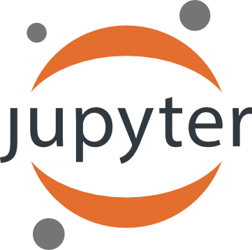

<!--
!      ___   _   ___ ___ ___ ___ 
!     |   \ /_\ | _ \ _ \ __| _ \
!     | |) / _ \|  _/  _/ _||   /
!     |___/_/ \_\_| |_| |___|_|_\
! 
! 
-->

DAPPER is a set of templates for benchmarking the performance of data assimilation (DA) methods.
The tests provide experimental support and guidance for new developments in DA. Example diagnostics:


The typical set-up is a **twin experiment**, where you
* specify a
  * dynamic model* 
  * observational model*
* use these to generate a synthetic
  * "truth"
  * and observations thereof*
* assess how different DA methods perform in estimating the truth,
    given the above starred (*) items.

DAPPER enables the numerical investigation of DA methods
through a variety of typical test cases and statistics.
It (a) reproduces numerical benchmarks results reported in the literature,
and (b) facilitates comparative studies,
thus promoting the (a) reliability and (b) relevance of the results.
DAPPER is (c) open source, written in Python, and (d) focuses on readability;
this promotes the (c) reproduction and (d) dissemination of the underlying science,
and makes it easy to adapt and extend.
In summary, it is well suited for teaching and fundamental DA research.
Also see its [drawbacks](#alternative-projects).


Installation
================================================
1. **Prerequisite**: python>=3.6 (suggest setting it up with [anaconda](https://www.anaconda.com/download)).  
Execute `python -V` (uppercase `V`) in a [terminal](https://docs.conda.io/projects/conda/en/latest/user-guide/getting-started.html#starting-conda) to assert that the version is 3.6 or higher.
2. **Install**: Download and extract (or `git clone`) DAPPER, `cd` into the resulting folder, and `pip install -e .`
3. **Test**: `python example_1.py`  

Step 2 can be replaced by 
`pip install da-dapper`
but this is not recommended since this hides away DAPPER as a library in your python path.

If the installation fails, you probably need to [create a new Python environment](https://docs.conda.io/projects/conda/en/latest/user-guide/getting-started.html#managing-environments).


Getting started
================================================
Read, run, and understand the scripts `example_{1,2,3}.py`.
Then, get familiar with the code.

The [docs](https://dapper.readthedocs.io/en/latest/)
provide processed docstrings,
but are far from complete.

Alternatively, see [DA-tutorials](https://github.com/nansencenter/DA-tutorials) for an intro to DA.


Methods
================================================
[References](https://dapper.readthedocs.io/en/latest/bib/bib.html)

Method                                                 | Literature reproduced
------------------------------------------------------ | ---------------------------------------
EnKF <sup>1</sup>                                      | Sak08, Hot15
EnKF-N                                                 | Boc12, Boc15
EnKS, EnRTS                                            | Raa16b
iEnKS / iEnKF / EnRML / ES-MDA <sup>2</sup>            | Sak12, Boc12, Boc14
LETKF, local & serial EAKF                             | Boc11
Sqrt. model noise methods                              | Raa15
Particle filter (bootstrap) <sup>3</sup>               | Boc10
Optimal/implicit Particle filter  <sup>3</sup>         | Boc10
NETF                                                   | Töd15, Wil16
Rank histogram filter (RHF)                            | And10
4D-Var                                                 | 
3D-Var                                                 | 
Extended KF                                            | 
Optimal interpolation                                  |
Climatology                                            |

<sup>1</sup>: Stochastic, DEnKF (i.e. half-update), ETKF (i.e. sym. sqrt.).
Serial forms are also available.  
Tuned with inflation and "random, orthogonal rotations".  
<sup>2</sup>: Also supports the bundle version, and "EnKF-N"-type inflation.  
<sup>3</sup>: Resampling: multinomial (including systematic/universal and residual).  
The particle filter is tuned with "effective-N monitoring", "regularization/jittering" strength, and more.


Models
================================================

Model             | Linear? | Phys.dim. | State len | # Lyap≥0 | Implementer
-----------       | ------- | --------- | --------- | -------- | ----------
Lin. Advect.      | Yes     | 1d        | 1000 *    | 51       | Evensen/Raanes
DoublePendulum    | No      | 0d        | 4         | 2        | Matplotlib/Raanes
LotkaVolterra     | No      | 0d        | 5 *       | 1        | Wikipedia/Raanes
Lorenz63          | No      | 0d        | 3         | 2        | Sakov
Lorenz84          | No      | 0d        | 3         | 2        | Raanes
Lorenz95          | No      | 1d        | 40 *      | 13       | Raanes
LorenzUV          | No      | 2x 1d     | 256 + 8 * | ≈60      | Raanes
Quasi-Geost       | No      | 2d        | 129²≈17k  | ≈140     | Sakov

*: flexible; set as necessary


Other reproductions
================================================
As mentioned [above](#Methods),
DAPPER reproduces literature results.
There are also plenty of results in the literature that DAPPER does not reproduce.
Typically, this means that the published results are incorrect.

A list of experimental settings that can be compared with literature papers
can be obtained using gnu's `find`:

			$ find . -iname "[a-z]*[0-9].py" | grep mods

Some of these files contain settings that have been used in several papers.


Alternative projects
================================================
DAPPER is aimed at research and teaching (see discussion on top).
Example of limitations:
 * It is not suited for very big models (>60k unknowns).
 * Time-dependent error covariances and changes in lengths of state/obs
     (although the Dyn and Obs models may otherwise be time-dependent).
 * Non-uniform time sequences not fully supported.

Also, DAPPER comes with no guarantees/support.
Therefore, if you have an *operational* (real-world) application,
such as WRF,
you should look into one of the alternatives,
sorted by approximate project size.

Name               | Developers            | Purpose (approximately)
------------------ | --------------------- | -----------------------------
[DART][1]          | NCAR                  | Operational, general
[PDAF][7]          | AWI                   | Operational, general
[JEDI][22]         | JCSDA (NOAA, NASA, ++)| Operational, general (in develpmt?)
[ERT][2]           | Statoil               | Operational, history matching (Petroleum)
[OpenDA][3]        | TU Delft              | Operational, general
[Verdandi][6]      | INRIA                 | Biophysical DA
[PyOSSE][8]        | Edinburgh, Reading    | Earth-observation DA
[SANGOMA][5]       | Conglomerate*         | Unify DA research
[EMPIRE][4]        | Reading (Met)         | Research (high-dim)
[MIKE][9]          | DHI                   | Oceanographic. Commercial?
[OAK][10]          | Liège                 | Oceaonagraphic
[Siroco][11]       | OMP                   | Oceaonagraphic
[FilterPy][12]     | R. Labbe              | Engineering, general intro to Kalman filter
[DASoftware][13]   | Yue Li, Stanford      | Matlab, large-scale
[Pomp][18]         | U of Michigan         | R, general state-estimation
[PyIT][14]         | CIPR                  | Real-world petroleum DA (?)
Datum              | Raanes                | Matlab, personal publications
[EnKF-Matlab][15]  | Sakov                 | Matlab, personal publications and intro
[EnKF-C][17]       | Sakov                 | C, light-weight EnKF, off-line
IEnKS code         | Bocquet               | Python, personal publications
[pyda][16]         | Hickman               | Python, personal publications

The `EnKF-Matlab` and `IEnKS` codes have been inspirational in the development of DAPPER. 

*: AWI/Liege/CNRS/NERSC/Reading/Delft

[1]:  http://www.image.ucar.edu/DAReS/DART/
[2]:  http://ert.nr.no/ert/index.php/Main_Page
[22]: https://www.jcsda.noaa.gov/index.php
[3]:  http://www.openda.org/
[4]:  http://www.met.reading.ac.uk/~darc/empire/index.php
[5]:  http://www.data-assimilation.net/
[6]:  http://verdandi.sourceforge.net/
[7]:  http://pdaf.awi.de/trac/wiki
[8]:  http://www.geos.ed.ac.uk/~lfeng/
[9]:  http://www.dhigroup.com/
[10]: http://modb.oce.ulg.ac.be/mediawiki/index.php/Ocean_Assimilation_Kit
[11]: https://www5.obs-mip.fr/sirocco/assimilation-tools/sequoia-data-assimilation-platform/
[12]: https://github.com/rlabbe/filterpy
[13]: https://github.com/judithyueli/DASoftware
[14]: http://uni.no/en/uni-cipr/
[15]: http://enkf.nersc.no/
[16]: http://hickmank.github.io/pyda/
[17]: https://github.com/sakov/enkf-c
[18]: https://github.com/kingaa/pomp


Contributors
================================================
Patrick N. Raanes,
Colin Grudzien,
Maxime Tondeur,
Remy Dubois

If you use this software in a publication, please cite as follows.

```bibtex
@misc{raanes2018dapper,
  author = {Patrick N. Raanes and others},
  title  = {nansencenter/DAPPER: Version 0.8},
  month  = December,
  year   = 2018,
  doi    = {10.5281/zenodo.2029296},
  url    = {https://doi.org/10.5281/zenodo.2029296}
}
```

Publication list
================================================
- https://www.geosci-model-dev-discuss.net/gmd-2019-136/
- https://rmets.onlinelibrary.wiley.com/doi/abs/10.1002/qj.3386
- https://www.nonlin-processes-geophys-discuss.net/npg-2019-10

Powered by
================================================
<div>



</div>

<!--

[](https://zenodo.org/badge/latestdoi/62547494)

[](./licence.txt)

-->


