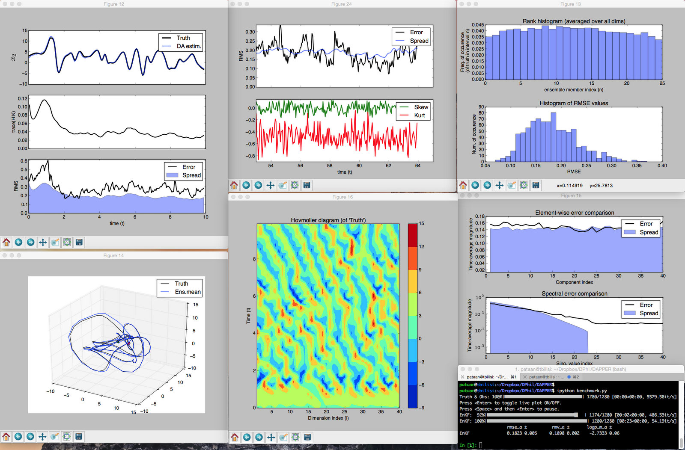

     ___   _   ___ ___ ___ ___ 
    |   \ /_\ | _ \ _ \ __| _ \
    | |) / _ \|  _/  _/ _||   /
    |___/_/ \_\_| |_| |___|_|_\

<!---

-->

DAPPER is a set of templates for benchmarking the performance of
[data assimilation (DA)](https://sites.google.com/site/patricknraanespro/DA_tut.pdf)
methods.
The tests provide experimental support and guidance for new developments in DA.

The typical set-up is a "twin experiment", where you
* specify a
	* dynamic model 
	* observational model 
* use these to generate a synthetic
	* "truth"
	* and observations thereof
* assess how different DA methods
	perform in estimating the truth

DAPPER successfully reproduces numerical results reported in the literature,
thus safeguarding the quality of its benchmarks.
Comparative studies are facilitated through its collection of typical test-cases, methods, and statistics.
It is thus well suited for fundamental DA research.

It is open source and written in Python, and thus easy to adapt and extend to further needs.

It also focuses on code readability, striking a beneficial compromise with efficiency,
and is therefore well suited for teaching and academic purposes.
However, its current documentation does not provide a tutorial;
new users should begin by looking at the code in `benchmark.py`
and work their way backward.

	
Installation
------------------------------------------------
Prerequisite: python3.5+ with scipy (e.g. from [anaconda](https://www.continuum.io/downloads))

Download, extract, and `cd` to DAPPER. Then run:

    > python -i benchmark.py

Methods
------------

Method name                        | Literature RMSE results reproduced
-----------------------------------| ---------------------------------------
EnKF (Stoch., DEnKF, ETKF)         | sakov'2008 ("deterministic")
EnKF-N                             | bocquet'2012 ("combining"), bocquet'2015 ("expanding")
EnKS, EnRTS                        | raanes'2016 ("EnRTS and EnKS")
Iterative versions of the above    | sakov'2012 ("an iterative"), TODO: bocquet'2014
LETKF, local & serial EAKF         |
Extended KF                        | raanes'2016 thesis
Particle filter (bootstrap)        | "
3D-Var                             | "
Climatology                        | "
TODO: Sqrt model noise methods     | raanes'2015 ("sqrt model noise")

Models
------------

Model name  | Linear? | Phys.dim. | State len.  | # Lyap>0 | Thanks to
----------- | ------- | --------- | ----------- | -------- | ----------
Lin. Advect.| Yes     | 1D        | 1000        |  51      | Evensen
Lorenz63    | No      | 0D        | 3           |  2+      | Lorenz/Sakov
Lorenz95    | No      | 1D        | 40          |  13+     | "
LorenzXY    | No      | 2x 1D     | 256 + 8     |  ≈13     | Lorenz/Raanes
MAOOAM      | No      | 2x 1D     | 36          |  ?       | Tondeur/Vannitsen
Barotropic  | No      | 2D        | 256^2 ≈ 60k |  ?       | J.Penn/Raanes

Additional features
------------------------------------------------
Many
* visualizations 
* diagnostics

And:
* Highly modular.
* Parallelizable
    * Forecast parallelization is possible since
        the (user-implemented) model has access to the full ensemble.
    * A light-weight alternative (see e.g. Lorenz95):
        native numpy vectorization (again by having access to full ensemble).
    * (Independent) experiments can also run in parallel.
        Auto-config provided by `utils.py:parallelize()`.

Also has:
* Progressbar
* Confidence interval on times series (e.g. rmse) with
	* automatic correction for autocorrelation 
	* significant digits printing
* X-platform random number generator
* Chronology/Ticker with consistency checks
* CovMat class (input flexibility/overloading, lazy eval)
* Live plotting with on/off toggle
* Intelligent defaults (e.g. plot duration estimated from autocorrelation,
    axis limits esitmated from percentiles)

Alternative projects
------------------------------------------------
Sorted by approximate project size.
DAPPER may be situated somewhere in the middle.

* DART         (NCAR)
* SANGOMA      (Liege/CNRS/Nersc/Reading/Delft)
* PDAF         (Nerger)
* ERT*         (Statoil)
* OpenDA       (TU Delft)
* PyOSSE       (Edinburgh)
* ?            (DHI)
* FilterPy     (R. Labbe)
* PyIT         (CIPR)
* Datum*       (Raanes)
* EnKF-Matlab* (Sakov)
* IEnKS code*  (Bocquet)
* pyda         (Hickman)

*Has been inspirational in the development of DAPPER. 

How to
------------------------------------------------
DAPPER is like a *set of templates* (not a framework);
do not hesitate make your own scripts and functions
(instead of squeezing everything into standardized configuration files).

#### Add a new method
Just add it to `da_algos.py`, using the others in there as templates.
(TODO: split `da_algos.py` into multiple files.)

#### Add a new model
* Make a new dir: `DAPPER/mods/`**your_mod**
    * Remember to include the empty file `__init__.py`
    * See other examples, e.g. `DAPPER/mods/Lorenz63/sak12.py`
* Make sure that your model (and obs operator) support
    * 2D-array (i.e. ensemble) and 1D-array (single realization) input
        (can typically be handled by `@atmost_2d` wrapper).
    * should not modify in-place.
* To begin with, test whether the model works
    * on 1 realization
    * on several realizations (simultaneously)
* Thereafter, try assimilating using
    * a big ensemble
    * a safe (e.g. 1.2) inflation value
    * small initial perturbations
      (big/sharp noises might cause model blow up)
		* small(er) integrational time step
			(assimilation might create instabilities)
    * very large observation noise (free run)
    * or very small observation noise (perfectly observed system)

Implementation choices
------------------------------------------------
* Uses python3.5+
* On-line vs off-line stats and diagnostics
* NEW: Use `N-by-m` ndarrays. Pros:
    * Python default
        * speed of (row-by-row) access, especially for models
        * ordering of random numbers
    * numpy sometimes returns ndarrays even when input is matrix
    * works well with ens space formulea,
        * e.g. 
        * yields beneficial operator precedence without `()`. E.g. `dy@Ri@Y.T@Pw`
    * Bocquet's choice
    * Broadcasting
    * Avoids reshape's and asmatrix
    * Fewer indices: `[:,k]` becomes `[k]`
* OLD: Use m-by-N matrix class. Pros:
    * Litterature uses `m-by-N`
    * Matrix class allowss desired broadcasting
    * Matrix multiplication through `*` -- Deprecated since python3.5

What it can't do
------------------------------------------------
* Store full ensembles (could write to file)
* Run different DA methods concurrently (i.e. step-by-step)
     allowing for live/online  (graphic or text) comparison
* Time-dependent noises and length changes in state/obs
     (but it does support autonomous f and h)
* Non-uniform time sequences

TODO
------------------------------------------------
* CovMat
		* Unify sparse and dense treatment
		* Read-only properties
* Plotting with the new ipython
* Barotropic model
		* 
* add_noise()
* Truncate SVD at 95 or 99% (evensen)
* Doc models
* 1D model preserving some quantity (aside from L95)
* 2D model
* KdVB model? (Zupanski 2006)
* Should (direct) observations return copy? e.g. x[:,obsInds].copy()
* Take advantage of pass-by-ref
* Decide on conflicts np vs math vs sp
* unify matrix vs array (e.g. randn)
* vs 1d array (e.g. xx[:,0] in L3.dxdt)

"Outreach"
---------------
* http://stackoverflow.com/a/38191145/38281
* http://stackoverflow.com/a/37861878/38281
