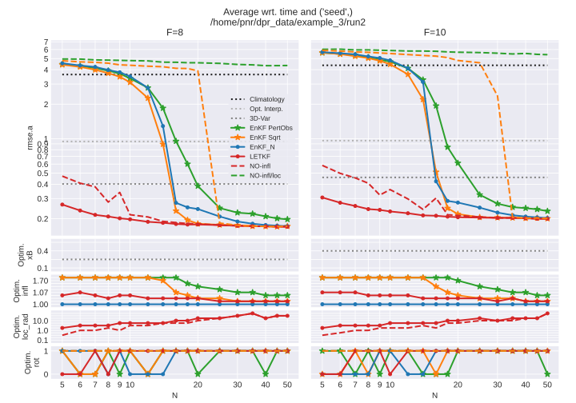

<!--
!      ___   _   ___ ___ ___ ___ 
!     |   \ /_\ | _ \ _ \ __| _ \
!     | |) / _ \|  _/  _/ _||   /
!     |___/_/ \_\_| |_| |___|_|_\
! 
! 
-->


DAPPER is a set of templates for benchmarking the performance of
data assimilation (DA) methods.
The tests provide experimental support and guidance for
new developments in DA.

The typical set-up is a **synthetic (twin) experiment**, where you

- specify a
  - dynamic model`*`
  - observational model`*`
- use these to generate a synthetic
  - "truth"
  - and observations thereof`*`
- assess how different DA methods perform in estimating the truth,
  given the above starred (`*`) items.

[](https://nansencenter.github.io/DAPPER)
[](https://travis-ci.com/nansencenter/DAPPER)
[](https://coveralls.io/github/nansencenter/DAPPER?branch=master)
[](https://github.com/pre-commit/pre-commit)
[](https://pypi.python.org/pypi/da-dapper/)
[](https://pypi.org/project/DA-DAPPER)
<!-- Inspiration: https://github.com/Naereen/badges
It seems hits.dwyl.com is overloaded at the moment -->


## Highlights

DAPPER enables the numerical investigation of DA methods
through a variety of typical test cases and statistics. It
(a) reproduces numerical benchmarks results reported in the literature, and
(b) facilitates comparative studies, thus promoting the
(a) reliability and
(b) relevance of the results.
For example, this figure is generated by `examples/basic_3.py` and is a
reproduction from this [book on DA](https://books.google.no/books?id=FtDZDQAAQBAJ&q=figure+6.6).



DAPPER is (c) open source, written in Python, and (d) focuses on readability;
this promotes the (c) reproduction and (d) dissemination of the underlying science,
and makes it easy to adapt and extend.
It also comes with a battery of diagnostics and statistics,
and live plotting (on-line with the assimilation) facilities,
including pause/inspect options, as illustrated below


In summary, it is well suited for teaching and fundamental DA research.
Also see its [drawbacks](#similar-projects).


## Installation

Works on Linux/Windows/Mac.

### Prerequisite: Python>=3.8

If you're not an admin or expert:  

- Install [Anaconda](https://www.anaconda.com/download).
- Open the [Anaconda terminal](https://docs.conda.io/projects/conda/en/latest/user-guide/getting-started.html#starting-conda)
  and run the following commands:

      conda create --yes --name my-env python=3.8
      conda activate my-env
      python -c 'import sys; print("Version:", sys.version.split()[0])'

  Ensure the output at the end gives a version bigger than 3.8.  
  Keep using the same terminal for the commands below.

### Install

#### *Either*: Install as library

*Do you simply want to run a script that requires DAPPER?* Then

- If the script come with a `requirements.txt` file, then do  
  `pip install -r path/to/requirements.txt`.
- If not, hopefully you know the version of DAPPER needed. Run  
  `pip install DA-DAPPER==1.0.0` to get version `1.0.0`.

#### *Or*: Install for development

*Do you want the DAPPER code readily available to look into?* Then

- Download and unzip (or `git clone`) DAPPER.
- Move the resulting folder wherever you like,  
  and `cd` into it
  *(ensure you're in the folder with a `setup.py` file)*.
- `pip install -e .` (don't forget the `.`).  
  Alternatively, if you want to develop the code, install with
  `pip install -e .[Dev]`

#### *Finally*: Test the installation

You should now be able to do run your script with
`python path/to/script.py`.  
For example, if you are in the DAPPER dir,

    python examples/basic_1.py

If you've closed the terminal (or shut down your computer),
you first need to open the (anaconda) terminal and run this:

    conda activate my-env

## Quickstart

Read, run, and understand the scripts `examples/basic_{1,2,3}.py`.
Then, get familiar with the code.

The [documentation](https://nansencenter.github.io/DAPPER)
provides more information, and the API reference.

Alternatively, [DA-tutorials](https://github.com/nansencenter/DA-tutorials)
provides a python-based introduction to DA.


## DA methods

<!-- markdownlint-capture -->
<!-- markdownlint-disable line-length -->
Method                                                 | Literature reproduced
------------------------------------------------------ | ------------------------
EnKF <sup>1</sup>                                      | [Sakov08](https://nansencenter.github.io/DAPPER/bib.html#bib.sakov2008deterministic), [Hoteit15](https://nansencenter.github.io/DAPPER/bib.html#bib.hoteit2015mitigating)
EnKF-N                                                 | [Bocquet12](https://nansencenter.github.io/DAPPER/bib.html#bib.bocquet2012combining), [Bocquet15](https://nansencenter.github.io/DAPPER/bib.html#bib.bocquet2015expanding)
EnKS, EnRTS                                            | [Raanes2016](https://nansencenter.github.io/DAPPER/bib.html#bib.raanes2016thesis)
iEnKS / iEnKF / EnRML / ES-MDA <sup>2</sup>            | [Sakov12](https://nansencenter.github.io/DAPPER/bib.html#bib.sakov2012iterative), [Bocquet12](https://nansencenter.github.io/DAPPER/bib.html#bib.Bocquet12), [Bocquet14](https://nansencenter.github.io/DAPPER/bib.html#bib.bocquet2014iterative)
LETKF, local & serial EAKF                             | [Bocquet11](https://nansencenter.github.io/DAPPER/bib.html#bib.bocquet2011ensemble)
Sqrt. model noise methods                              | [Raanes2014](https://nansencenter.github.io/DAPPER/bib.html#bib.raanes2014ext)
Particle filter (bootstrap) <sup>3</sup>               | [Bocquet10](https://nansencenter.github.io/DAPPER/bib.html#bib.bocquet2010beyond)
Optimal/implicit Particle filter  <sup>3</sup>         | [Bocquet10](https://nansencenter.github.io/DAPPER/bib.html#bib.bocquet2010beyond)
NETF                                                   | [Tödter15](https://nansencenter.github.io/DAPPER/bib.html#bib.todter2015second), [Wiljes16](https://nansencenter.github.io/DAPPER/bib.html#bib.wiljes2016second)
Rank histogram filter (RHF)                            | [Anderson10](https://nansencenter.github.io/DAPPER/bib.html#bib.anderson2010non)
4D-Var                                                 |
3D-Var                                                 |
Extended KF                                            |
Optimal interpolation                                  |
Climatology                                            |
<!-- markdownlint-restore -->

<sup>1</sup>: Stochastic, DEnKF (i.e. half-update), ETKF (i.e. sym. sqrt.).
Serial forms are also available.  
Tuned with inflation and "random, orthogonal rotations".  
<sup>2</sup>: Also supports the bundle version,
and "EnKF-N"-type inflation.  
<sup>3</sup>: Resampling: multinomial
(including systematic/universal and residual).  
The particle filter is tuned with "effective-N monitoring",
"regularization/jittering" strength, and more.

For a list of ready-made experiments with suitable,
tuned settings for a given method (e.g. the `iEnKS`), use gnu's grep:

```sh
cd dapper/mods
grep -r "iEnKS.*("
```


## Test cases (models)

Model                | Lin? | TLM+? | PDE?  | Phys.dim. | State len | Lyap≥0 | Implementer
-----------          | ---- | ----- | ----  | --------- | --------- | ------ | ----------
Linear Advect. (LA)  | Yes  | Yes   | Yes   | 1d        | 1000 *    | 51     | Evensen/Raanes
DoublePendulum       | No   | Yes   | No    | 0d        | 4         | 2      | Matplotlib/Raanes
Ikeda                | No   | Yes   | No    | 0d        | 2         | 1      | Raanes
LotkaVolterra        | No   | Yes   | No    | 0d        | 5 *       | 1      | Wikipedia/Raanes
Lorenz63             | No   | Yes   | "Yes" | 0d        | 3         | 2      | Sakov
Lorenz84             | No   | Yes   | No    | 0d        | 3         | 2      | Raanes
Lorenz96             | No   | Yes   | No    | 1d        | 40 *      | 13     | Raanes
LorenzUV             | No   | Yes   | No    | 2x 1d     | 256 + 8 * | ≈60    | Raanes
Kuramoto-Sivashinsky | No   | Yes   | Yes   | 1d        | 128 *     | 11     | Kassam/Raanes
Quasi-Geost (QG)     | No   | No    | Yes   | 2d        | 129²≈17k  | ≈140   | Sakov

- *: Flexible; set as necessary
- +: Tangent Linear Model included?

The models are found as subdirectories within `dapper/mods`.
A model should be defined in a file named `__init__.py`,
and illustrated by a file named `demo.py`.
Ideally, both of these files do not rely on the rest of DAPPER.
[More info](https://dapper.readthedocs.io/en/latest/adding.html).

Most of the other files within a model subdirectory
are usually named `authorYEAR.py` and define a `HMM` object,
which holds the settings of a specific twin experiment,
using that model,
as detailed in the corresponding author/year's paper.
At the bottom of each such file should be (in comments)
a list of suitable, tuned settings for various DA methods,
along with their expected, average rmse.a score for that experiment.
The complete list of included experiment files can be obtained with
gnu's `find`:

```sh
cd dapper/mods
find . -iname "[a-z]*20[0-9].py"
```

Some of these files contain settings that have been used in several papers.
As mentioned [above](#Methods),
DAPPER reproduces literature results.
There are also results in the literature that DAPPER does not reproduce.
Typically, this means that the published results are incorrect.


## Similar projects

DAPPER is aimed at research and teaching (see discussion up top).
Example of limitations:

- It is not suited for very big models (>60k unknowns).
- Time-dependent error covariances and changes in lengths of state/obs
  (although the Dyn and Obs models may otherwise be time-dependent).
- Non-uniform time sequences not fully supported.

Also, DAPPER comes with no guarantees/support.
Therefore, if you have an *operational* (real-world) application,
such as WRF,
you should look into one of the alternatives,
sorted by approximate project size.

Name               | Developers            | Purpose (approximately)
------------------ | --------------------- | -----------------------------
[DART][1]          | NCAR                  | Operational, general
[PDAF][7]          | AWI                   | Operational, general
[JEDI][22]         | JCSDA (NOAA, NASA, ++)| Operational, general (in develpmt?)
[ERT][2]           | Statoil               | Operational, history matching (Petroleum)
[OpenDA][3]        | TU Delft              | Operational, general
[Verdandi][6]      | INRIA                 | Biophysical DA
[PyOSSE][8]        | Edinburgh, Reading    | Earth-observation DA
[SANGOMA][5]       | Conglomerate*         | Unify DA research
[EMPIRE][4]        | Reading (Met)         | Research (high-dim)
[MIKE][9]          | DHI                   | Oceanographic. Commercial?
[OAK][10]          | Liège                 | Oceaonagraphic
[Siroco][11]       | OMP                   | Oceaonagraphic
[FilterPy][12]     | R. Labbe              | Engineering, general intro to Kalman filter
[DASoftware][13]   | Yue Li, Stanford      | Matlab, large-scale
[Pomp][18]         | U of Michigan         | R, general state-estimation
[PyIT][14]         | CIPR                  | Real-world petroleum DA (?)
[EnKF-Matlab][15]  | Sakov                 | Matlab, personal publications and intro
[EnKF-C][17]       | Sakov                 | C, light-weight EnKF, off-line
[pyda][16]         | Hickman               | Python, personal publications
Datum              | Raanes                | Matlab, personal publications
IEnKS code         | Bocquet               | Python, personal publications

The `EnKF-Matlab` and `IEnKS` codes have been inspirational
in the development of DAPPER.

*: AWI/Liege/CNRS/NERSC/Reading/Delft

[1]:  http://www.image.ucar.edu/DAReS/DART/
[2]:  http://ert.nr.no/ert/index.php/Main_Page
[22]: https://www.jcsda.noaa.gov/index.php
[3]:  http://www.openda.org/
[4]:  http://www.met.reading.ac.uk/~darc/empire/index.php
[5]:  http://www.data-assimilation.net/
[6]:  http://verdandi.sourceforge.net/
[7]:  http://pdaf.awi.de/trac/wiki
[8]:  http://www.geos.ed.ac.uk/~lfeng/
[9]:  http://www.dhigroup.com/
[10]: http://modb.oce.ulg.ac.be/mediawiki/index.php/Ocean_Assimilation_Kit
[11]: https://www5.obs-mip.fr/sirocco/assimilation-tools/sequoia-data-assimilation-platform/
[12]: https://github.com/rlabbe/filterpy
[13]: https://github.com/judithyueli/DASoftware
[14]: http://uni.no/en/uni-cipr/
[15]: http://enkf.nersc.no/
[16]: http://hickmank.github.io/pyda/
[17]: https://github.com/sakov/enkf-c
[18]: https://github.com/kingaa/pomp


## Contributors

Patrick N. Raanes,
Colin Grudzien,
Maxime Tondeur,
Remy Dubois

If you use this software in a publication, please cite as follows.

```bibtex
@misc{raanes2018dapper,
  author = {Patrick N. Raanes and others},
  title  = {nansencenter/DAPPER: Version 0.8},
  month  = December,
  year   = 2018,
  doi    = {10.5281/zenodo.2029296},
  url    = {https://doi.org/10.5281/zenodo.2029296}
}
```

[](https://doi.org/10.5281/zenodo.2029296)

DAPPER is developed and maintained at
NORCE (Norwegian Research Institute)
and the Nansen Environmental and Remote Sensing Center


## Publication list

- <https://www.geosci-model-dev-discuss.net/gmd-2019-136/>
- <https://rmets.onlinelibrary.wiley.com/doi/abs/10.1002/qj.3386>
- <https://www.nonlin-processes-geophys-discuss.net/npg-2019-10>
- Stein
- EmblAUS/Springer chapter


<!-- markdownlint-configure-file
{
  "no-multiple-blanks": false,
  "first-line-h1": false,
  "no-inline-html": {
    "allowed_elements": [ "img", "sup" ]
  },
  "code-block-style": false,
  "ul-indent": { "indent": 2 }
}
-->
