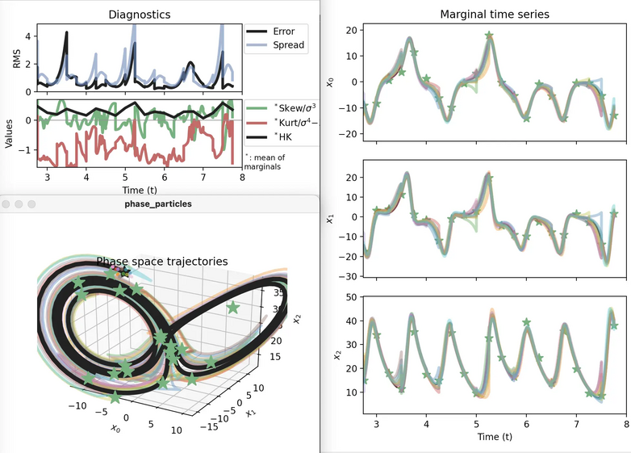

# Summary

Data assimilation (DA) is the science of optimally combining sparse data and
computational models, both of which are typically large and varied.
Based on classical statistics, signal processing, and control systems theory,
and increasingly, machine learning, DA was primarily developed in weather,
climate, and oceanographic forecasting but is presently used all across the
geosciences and beyond.
DAPPER is a set of templates for benchmarking the performance of DA methods.

# Statement of need

DAPPER provides experimental support and guidance for new developments in DA
by facilitating numerical investigations through a variety of
typical test cases and statistics. It reproduces numerical benchmarks
results reported in the literature and facilitates comparative studies,
thus promoting the reliability and relevance of the results.
DAPPER is open source, written in Python, and focuses on readability;
this promotes the reproduction and dissemination of the underlying
science, and makes it easy to adapt and extend.

# State of the field

The README contains a comprehensive list of related projects.
Among projects aimed at research and teaching,
DAPPER is probably the most mature,
while it is small is size and complexity
compared to those targeting real-world applications, such as
[DART](https://dart.ucar.edu/),
[PDAF](https://pdaf.awi.de/trac/wiki),
[JEDI](https://www.jcsda.org/jcsda-project-jedi), and
[OpenDA](https://openda.org/).
The README also lists 5 publications (to date) that used DAPPER,
and those results published in the literature that have been reproduced with DAPPER,
of which we mention [@asch2016data; @bocquet2014iterative; @anderson2010non].

# Outlook

The intention is for DAPPER to continue
benchmarking and illustrating the latest methods in DA and beyond.
For example, at the time of writing,
there are 26 open ticket in the repository's issue tracker.
Most have been opened by the principle investigator,
and are tagged with *enhancement*.
These are not necessarily minor, and have mainly been filed
under the `v2` milestone.

# Acknowledgements

We acknowledge support from Alberto Carrassi and Laurent Bertino of NERSC
in the genesis of this project, continued financial backing from NORCE,
and contributions from Maxime Tondeur, and Remy Dubois.

# References
